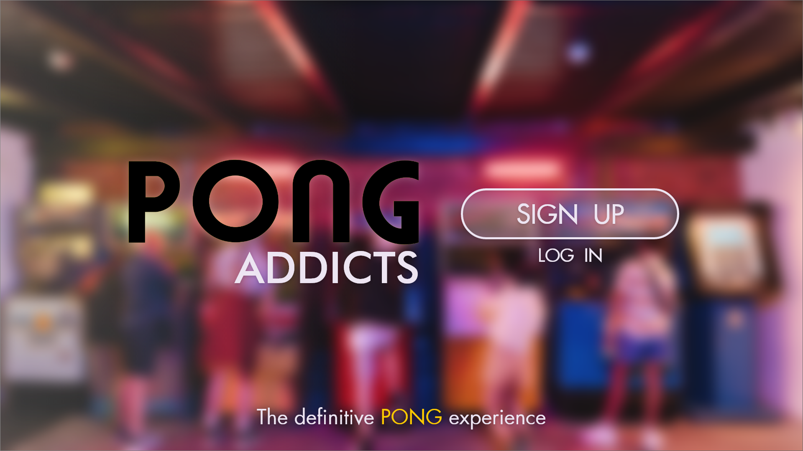

<div id="top"></div>
<!--
*** Amazing README template from othneildrew
*** https://github.com/othneildrew/Best-README-Template
-->


<!-- PROJECT LOGO -->
<br />
<div align="center">
  <h1>ft_transcendence</h1>
  
</div>

## 📺 Webpage Tour
[Whatch on YouTube](https://youtu.be/EZmRO-OFeGE)

<!-- ABOUT THE PROJECT -->
## ℹ️ About The Project

_42 Project_

The project consisted on making a webpage where you could play PONG and which had a chat system, user profiles, friends and ranking included.
We were demanded to have our backend in NestJS, database in PostgreSQL and our frontend in any ts framework. Everything would be mounted with docker-compose.

### Subject

* [Subject](https://cdn.intra.42.fr/pdf/pdf/32102/en.subject.pdf)

### Built With

* [Angular](https://angular.io/)
* [NestJS](https://nestjs.com/)
* [PostgreSQL](https://www.postgresql.org/)
* [Docker](https://www.docker.com/)

<p align="right">(<a href="#top">back to top</a>)</p>


<!-- GETTING STARTED -->
## 🏃 Quick Start

### Important

* Project has only been tested and runned on macOS systems

### Prerequisites

* Have [Docker](https://www.docker.com/) installed

### Installation

* Clone the repo
```sh
  git clone https://github.com/its-a-maxi/ft_transcendence.git
```
  
<p align="right">(<a href="#top">back to top</a>)</p>


<!-- USAGE EXAMPLES -->
## ⌨️ Usage

* Build the app with docker-compose
```sh
  docker-compose up --build
```

* Navigate to [localhost:4200](http://localhost:4200/)

<p align="right">(<a href="#top">back to top</a>)</p>


<!-- CONTACT -->
## 📫 Contact

Maximo Monroy - monroy.vds@gmail.com

Alejandro León - https://github.com/ElHuaco

Fernando Jimenez - https://github.com/fjimenez81

Project Link: [https://github.com/its-a-maxi/ft_transcendence](https://github.com/its-a-maxi/ft_transcendence)

<p align="right">(<a href="#top">back to top</a>)</p>


<!-- ACKNOWLEDGMENTS -->
## 🥇 Acknowledgments

* Update pending

<p align="right">(<a href="#top">back to top</a>)</p>

